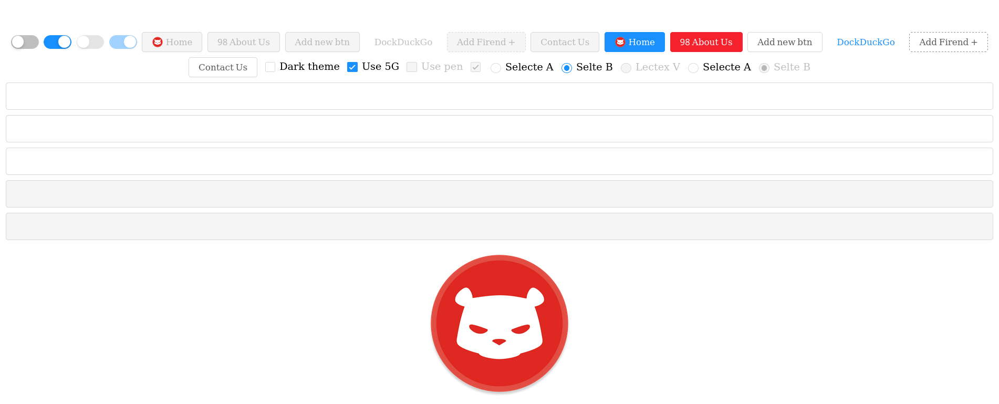

This project is a try to build UI library based on [Seed](https://seed-rs.org/).

I'll add docs and other introduections once this project get stable, while then
you can explore the code your self :D.

## Screenshot
these screenshots will represnte current state for this proejct

#### License

Licensed under either of <a href="LICENSE-APACHE">Apache License, Version
2.0</a> or <a href="LICENSE-MIT">MIT license</a> at your option.

Unless you explicitly state otherwise, any contribution intentionally submitted
for inclusion in Khalas by you, as defined in the Apache-2.0 license, shall be
dual licensed as above, without any additional terms or conditions.
