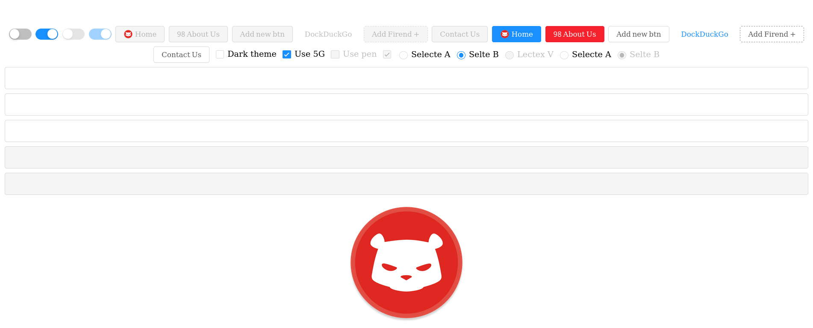

# Savory
**Rust / Wasm frontend library for building user interfaces.**

[](https://malrusayni.gitlab.io/savory/savory_core/)
&middot;
[](https://crates.io/crates/savory_core)
&middot;
[](https://gitlab.com/MAlrusayni/savory/pipelines)
&middot;
[](https://crates.io/crates/savory)
&middot;
[](https://github.com/rust-secure-code/safety-dance/)

Savory is library for building user interface based on [Seed]

[Documentation](https://malrusayni.gitlab.io/savory/savory_core/)

# Features

- **Views**: Views can be any type implement `View` trait or any standalone
  function that returns `Node`, views can be trait object which make them very
  composable.
- **Elements**: Savory uses elements as core building unit when building
  stateful UI. Elements owns thier state and handle user inputs via messages.
- **Collection of UI elements**: Savory ships with collection of resuable and
  themeable UI elements.
- **Theme**: UI elements can be themed by any type that implement `ThemeImpl`
  trait, themes have full control on the element appearance.
- **Typed HTML**: Use typed CSS and HTML attributes, Savory try hard not to rely
  on strings when creating CSS and HTML attributes since these can produce hard
  to debug bugs.
- **Enhance Seed API**: Enhancement on Seed API that makes working with `Node`,
  `Orders` fun.

Savory tries to make writing UI elements fun and boilerplate free.

Savory crates:
- `savory`: savory CLI
- [`savory_core`]: Library for building user interface
- [`savory_html`]: Typed HTML for Savory
- [`savory_elements`]: UI Elements based on Savory
- [`savory_derive`]: Helper derives

# Screenshot



# Examples

Here we will create the same counter app found in [Elm tutorial], then we will
write the same app but with styled and reusable element.

## Simple Counter

``` rust
use savory_core::prelude::*;
use savory_html::prelude::*;
use wasm_bindgen::prelude::*;

// app element (the model)
pub struct Counter(i32);

// app message
pub enum Msg {
    Increment,
    Decrement,
}

impl HasConfig for Counter {
    type Config = Url;
}

impl Element<Msg> for Counter {
    type Message = Msg;

    // initialize the app in this function
    fn init(_: Url, _: &mut impl Orders<Msg>) -> Self {
        Self(0)
    }

    // handle app messages
    fn update(&mut self, msg: Msg, _: &mut impl Orders<Msg>) {
        match msg {
            Msg::Increment => self.0 += 1,
            Msg::Decrement => self.0 -= 1,
        }
    }
}

impl View for Counter {
    type Output = Node<Msg>;

    // view the app
    fn view(&self) -> Self::Output {
        let inc_btn = html::button()
            .add("Increment")
            .and_events(|events| events.click(|_| Msg::Increment));

        let dec_btn = html::button()
            .add("Decrement")
            .and_events(|events| events.click(|_| Msg::Decrement));

        html::div()
            .add(inc_btn)
            .add(self.0.to_string())
            .add(dec_btn)
    }
}

#[wasm_bindgen(start)]
pub fn view() {
    // mount and start the app at `app` element
    Counter::start();
}
```

Preview:


[source code](https://gitlab.com/MAlrusayni/savory/-/tree/master/examples/simple_counter)

## Counter As Element

Now we will make counter element and an app element this illustrate how to make
parent and child element, and how to make resuable and stylable element.

``` rust
use savory_core::prelude::*;
use savory_elements::prelude::*;
use savory_html::{
    css::{unit::px, values as val, Color, St},
    prelude::*,
};
use wasm_bindgen::prelude::*;

#[derive(Element)]
#[element(style(inc_btn, dec_btn), events(inc_btn, dec_btn))]
pub struct Counter<PMsg> {
    #[element(config(required))]
    msg_mapper: MsgMapper<Msg, PMsg>,
    local_events: Events<Msg>,
    #[element(config(default = "10"))]
    value: i32,
}

pub enum Msg {
    Increment,
    Decrement,
}

impl<PMsg: 'static> Element<PMsg> for Counter<PMsg> {
    type Message = Msg;

    fn init(config: Self::Config, _: &mut impl Orders<PMsg>) -> Self {
        let local_events = Events::default()
            // increment button events
            .and_inc_btn(|conf| conf.click(|_| Msg::Increment))
            // decrement button events
            .and_dec_btn(|conf| conf.click(|_| Msg::Decrement));

        Self {
            msg_mapper: config.msg_mapper,
            local_events,
            value: config.value,
        }
    }

    fn update(&mut self, msg: Msg, _: &mut impl Orders<PMsg>) {
        match msg {
            Msg::Increment => self.value += 1,
            Msg::Decrement => self.value -= 1,
        }
    }
}

impl<PMsg: 'static> View for Counter<PMsg> {
    type Output = Node<PMsg>;

    fn view(&self) -> Self::Output {
        // sharde style for buttons
        let style_btns = |conf: css::Style| {
            conf.add(St::Appearance, val::None)
                .background(Color::SlateBlue)
                .text(Color::White)
                .and_border(|conf| conf.none().radius(px(4)))
                .margin(px(4))
                .padding(px(4))
        };

        // create style
        let style = Style::default()
            .and_inc_btn(style_btns)
            .and_dec_btn(style_btns);

        // increment button node
        let inc_btn = html::button()
            .class("inc-btn")
            .set(style.inc_btn)
            .set(&self.local_events.inc_btn)
            .add("Increment");

        // decrement button node
        let dec_btn = html::button()
            .class("dec-btn")
            .set(style.dec_btn)
            .set(&self.local_events.dec_btn)
            .add("Decrement");

        // contianer node
        html::div()
            .add(dec_btn)
            .add(self.value.to_string())
            .add(inc_btn)
            // map the output node to the parent node
            .map_msg_with(&self.msg_mapper)
    }
}

// convenient way to convert Config into Counter
impl<PMsg: 'static> Config<PMsg> {
    pub fn init(self, orders: &mut impl Orders<PMsg>) -> Counter<PMsg> {
        Counter::init(self, orders)
    }
}

// App Element ---

pub enum AppMsg {
    Counter(Msg),
}

pub struct MyApp {
    counter_element: Counter<AppMsg>,
}

impl HasConfig for MyApp {
    type Config = Url;
}

impl Element<AppMsg> for MyApp {
    type Message = AppMsg;

    fn init(_: Url, orders: &mut impl Orders<AppMsg>) -> Self {
        Self {
            counter_element: Counter::config(AppMsg::Counter)
                // give it starting value. 10 will be used as default value if
                // we didn't pass value
                .value(100)
                .init(orders),
        }
    }

    fn update(&mut self, msg: AppMsg, orders: &mut impl Orders<AppMsg>) {
        match msg {
            AppMsg::Counter(msg) => self.counter_element.update(msg, orders),
        }
    }
}

impl View for MyApp {
    type Output = Node<AppMsg>;

    fn view(&self) -> Self::Output {
        self.counter_element.view()
    }
}

#[wasm_bindgen(start)]
pub fn view() {
    // mount and start the app at `app` element
    MyApp::start();
}
```

Preview:


[source code](https://gitlab.com/MAlrusayni/savory/-/tree/master/examples/counter_element)

A lot of things happening in this example, first we have create element struct
`Counter`, and defined its properties, events and style types, this is all done
by the derive macro `Element` which we will explain how it work later, then we
defined an app element that containes the counter element and initialize it in
the `init` funtion. at the end we just call `start` method to mount and start
the app.

## Counter using Savory Elements!

Savory ships with collections of elements, and we will use them to build counter
app and see what features Savory elements gives us.

``` rust
use savory_core::prelude::*;
use savory_elements::prelude::*;
use wasm_bindgen::prelude::*;

pub struct MyApp {
    spin_entry: SpinEntry<Msg>,
}

pub enum Msg {
    SpinEntry(spin_entry::Msg),
}

impl HasConfig for MyApp {
    type Config = Url;
}

impl Element<Msg> for MyApp {
    type Message = Msg;

    fn init(_: Url, orders: &mut impl Orders<Msg>) -> Self {
        let spin_entry = SpinEntry::config(Msg::SpinEntry)
            .min(-40.)
            .placeholder(44.)
            .step(5.)
            .max(40.)
            .init(orders);

        Self { spin_entry }
    }

    fn update(&mut self, msg: Msg, orders: &mut impl Orders<Msg>) {
        match msg {
            Msg::SpinEntry(msg) => self.spin_entry.update(msg, orders),
        };
    }
}

impl View for MyApp {
    type Output = Node<Msg>;

    fn view(&self) -> Self::Output {
        Flexbox::new()
            .center()
            .add(&self.spin_entry)
            .and_size(|conf| conf.full())
            .view()
    }
}

#[wasm_bindgen(start)]
pub fn view() {
    MyApp::start();
}
```

Preview:


[source code](https://gitlab.com/MAlrusayni/savory/-/tree/master/examples/counter_using_savory_elements)

As you can see this example have less lines and more features, what a neat.

It happens that Savory elements have `SpinEntry` element, which work just like
counter, and we used it in our example as simple as that, so Savory tries to
provides you the most needed elements so you don't need to build every thing
from scratch, even if you want build your own element in some way, you can still
use Savory elements as building block in your own element.

# Qucikstart

first thing first, add savory crates into your `Cargo.toml` file:
``` toml
savory_core = { git = "https://gitlab.com/MAlrusayni/savory/tree/master/core" }
savory_elements = { git = "https://gitlab.com/MAlrusayni/savory/tree/master/elements" }
savory_html = { git = "https://gitlab.com/MAlrusayni/savory/tree/master/html" }
wasm-bindgen = "0.2.55"
```

TODO

# License

Licensed under either of <a href="LICENSE-APACHE">Apache License, Version
2.0</a> or <a href="LICENSE-MIT">MIT license</a> at your option.

Unless you explicitly state otherwise, any contribution intentionally submitted
for inclusion in Savory by you, as defined in the Apache-2.0 license, shall be
dual licensed as above, without any additional terms or conditions.


[Seed]: https://seed-rs.org/
[Elm tutorial]: https://guide.elm-lang.org/
[`savory_core`]: https://gitlab.com/MAlrusayni/savory/tree/master/core
[`savory_html`]: https://gitlab.com/MAlrusayni/savory/tree/master/html
[`savory_elements`]: https://gitlab.com/MAlrusayni/savory/tree/master/elements
[`savory_derive`]: https://gitlab.com/MAlrusayni/savory/tree/master
