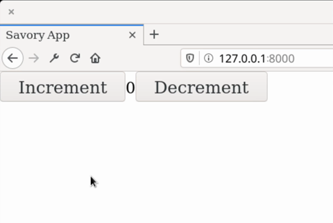

# Savory
**Rust / Wasm frontend library for building user interfaces.**

[](https://malrusayni.gitlab.io/savory/savory/)
&middot;
[](https://crates.io/crates/savory)
&middot;
[](https://gitlab.com/MAlrusayni/savory/pipelines)
&middot;
[](https://crates.io/crates/savory)
&middot;
[](https://github.com/rust-secure-code/safety-dance/)

Savory is library for building user interface based on [Seed]

[Documentation](https://malrusayni.gitlab.io/savory/savory/)

# Features

- **Design System**: Elements are fully styled using `DesignSystem`.
- **Reusability**: Elements are highly reusable/composable.
- **Decoupled Developemnt**: Design Systems can be developed in seprate crate
  without even touching elements code, and the same for elements developemnt,
  the are developed sepratedly from the design system, thanks to
  `DesignSystemImpl` trait.
- **Clean View**: build your view in a clean and declarative way, no more macros at
  all.
- **Trait Based**: embrace Rust trait system, all savory elements implments
  `Element` and/or `View` trait.
- **Typed HTML**: Use typed CSS and HTML attributes, Savory try hard not to rely
  on strings when creating CSS and HTML attributes since these can produce hard
  to debug bugs.
- **Collection of UI elements**: Savory ships with collection of resuable and
  themeable UI elements.
- **Enhance Seed API**: Enhancement on Seed API that makes working with `Node`,
  `Orders` fun.

Savory tries to make writing UI elements fun and boilerplate free.

# Screenshot


# Get Started

The quickest way to get started is by following the [**Savory Get
Started**](https://gitlab.com/MAlrusayni/savory-quick-start) repo instruction.

# Examples

Check out [examples](./examples) for full list of examples.

## Simple Counter

Here we will create the same counter app found in [Elm tutorial], then we will
write the same app but with styled and reusable element.

```rust
use savory::prelude::*;

// app element (the model)
pub struct Counter(i32);

// app message
pub enum Msg {
    Increment,
    Decrement,
}

impl Element for Counter {
    type Message = Msg;
    type Config = Url;

    // initialize the app in this function
    fn init(_: Url, _: &mut impl Orders<Msg>, _: Env) -> Self {
        Self(0)
    }

    // handle app messages
    fn update(&mut self, msg: Msg, _: &mut impl Orders<Msg>) {
        match msg {
            Msg::Increment => self.0 += 1,
            Msg::Decrement => self.0 -= 1,
        }
    }
}

impl View<Node<Msg>> for Counter {
    // view the app
    fn view(&self) -> Node<Msg> {
        let inc_btn = html::button()
            .push("Increment")
            .on_click(|_| Msg::Increment);
        let dec_btn = html::button()
            .push("Decrement")
            .on_click(|_| Msg::Decrement);

        html::div()
            .push(inc_btn)
            .push(self.0.to_string())
            .push(dec_btn)
    }
}

#[wasm_bindgen(start)]
pub fn view() {
    // mount and start the app at `app` element
    Counter::start();
}
```

Preview:


[source code](https://gitlab.com/MAlrusayni/savory/-/tree/master/examples/simple_counter)


# Ecosystem

- [`savory`] - Core library for building user interface
- [`savory-router`] - Savory Router used to generate router for your app
- [`savory-style`] - Typed CSS style for Savory
- [`savory-elements`] - Collection of UI elements based on Savory
- [`savory-elements-derive`] - Crate that provide `Element` derive

# License

Licensed under either of <a href="LICENSE-APACHE">Apache License, Version
2.0</a> or <a href="LICENSE-MIT">MIT license</a> at your option.

Unless you explicitly state otherwise, any contribution intentionally submitted
for inclusion in Savory by you, as defined in the Apache-2.0 license, shall be
dual licensed as above, without any additional terms or conditions.


[Seed]: https://seed-rs.org/
[Elm tutorial]: https://guide.elm-lang.org/
[`savory`]: https://gitlab.com/MAlrusayni/savory/tree/master/core
[`savory-router`]: https://gitlab.com/MAlrusayni/savory/tree/master/router
[`savory-style`]: https://gitlab.com/MAlrusayni/savory/tree/master/style
[`savory-elements`]: https://gitlab.com/MAlrusayni/savory/tree/master/elements
[`savory-elements-derive`]: https://gitlab.com/MAlrusayni/savory/tree/master/elements-derive
