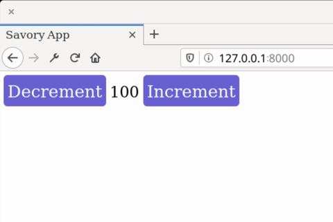

# Savory
**Rust / Wasm frontend library for building user interfaces.**

[](https://malrusayni.gitlab.io/savory/savory/)
&middot;
[](https://crates.io/crates/savory)
&middot;
[](https://gitlab.com/MAlrusayni/savory/pipelines)
&middot;
[](https://crates.io/crates/savory)
&middot;
[](https://github.com/rust-secure-code/safety-dance/)

Savory is library for building user interface based on [Seed]

[Documentation](https://malrusayni.gitlab.io/savory/savory/)

# Features

- **Design System**: Elements are fully styled using `DesignSystem`.
- **Reusability**: Elements are highly reusable/composable.
- **Decoupled Developemnt**: Design Systems can be developed in seprate crate
  without even touching elements code, and the same for elements developemnt,
  the are developed sepratedly from the design system, thanks to
  `DesignSystemImpl` trait.
- **Clean View**: build your view in a clean and declarative way, no more macros at
  all.
- **Trait Based**: embrace Rust trait system, all savory elements implments
  `Element` and/or `View` trait.
- **Typed HTML**: Use typed CSS and HTML attributes, Savory try hard not to rely
  on strings when creating CSS and HTML attributes since these can produce hard
  to debug bugs.
- **Collection of UI elements**: Savory ships with collection of resuable and
  themeable UI elements.
- **Enhance Seed API**: Enhancement on Seed API that makes working with `Node`,
  `Orders` fun.

Savory tries to make writing UI elements fun and boilerplate free.

# Screenshot


# Get Started

The quickest way to get started is by following the [**Savory Get
Started**](https://gitlab.com/MAlrusayni/savory-quick-start) repo instruction.

# Examples

Here we will create the same counter app found in [Elm tutorial], then we will
write the same app but with styled and reusable element.

## Simple Counter

```rust
use savory::prelude::*;

// app element (the model)
pub struct Counter(i32);

// app message
pub enum Msg {
    Increment,
    Decrement,
}

impl Element for Counter {
    type Message = Msg;
    type Config = Url;

    // initialize the app in this function
    fn init(_: Url, _: &mut impl Orders<Msg>) -> Self {
        Self(0)
    }

    // handle app messages
    fn update(&mut self, msg: Msg, _: &mut impl Orders<Msg>) {
        match msg {
            Msg::Increment => self.0 += 1,
            Msg::Decrement => self.0 -= 1,
        }
    }
}

impl View<Node<Msg>> for Counter {
    // view the app
    fn view(&self) -> Node<Msg> {
        let inc_btn = html::button().push("Increment").on_click(|_| Msg::Increment);
        let dec_btn = html::button().push("Decrement").on_click(|_| Msg::Decrement);

        html::div()
            .push(inc_btn)
            .push(self.0.to_string())
            .push(dec_btn)
    }
}

#[wasm_bindgen(start)]
pub fn view() {
    // mount and start the app at `app` element
    Counter::start();
}
```

Preview:


[source code](https://gitlab.com/MAlrusayni/savory/-/tree/master/examples/simple_counter)

## Counter As Element

Now we will make counter element and an app element this illustrate how to make
parent and child element, and how to make resuable and stylable element.

```rust
use savory::prelude::*;
use savory_elements::prelude::*;
use savory_style::{
    css::{unit::px, values as val, Color, St},
    prelude::*,
};

#[derive(Element)]
pub struct Counter {
    #[element(config(default = "10"))]
    value: i32,
}

pub enum Msg {
    Increment,
    Decrement,
}

impl Element for Counter {
    type Message = Msg;
    type Config = Config;

    fn init(config: Self::Config, _: &mut impl Orders<Msg>) -> Self {
        Self {
            value: config.value,
        }
    }

    fn update(&mut self, msg: Msg, _: &mut impl Orders<Msg>) {
        match msg {
            Msg::Increment => self.value += 1,
            Msg::Decrement => self.value -= 1,
        }
    }
}

impl View<Node<Msg>> for Counter {
    fn view(&self) -> Node<Msg> {
        // sharde style for buttons
        let style_btns = |conf: css::Style| {
            conf.push(St::Appearance, val::None)
                .background(Color::SlateBlue)
                .text(Color::White)
                .and_border(|conf| conf.none().radius(px(4)))
                .margin(px(4))
                .padding(px(4))
        };

        // increment button node
        let inc_btn = html::button()
            .class("inc-btn")
            .and_style(style_btns)
            .on_click(|_| Msg::Increment)
            .push("Increment");

        // decrement button node
        let dec_btn = html::button()
            .class("dec-btn")
            .and_style(style_btns)
            .on_click(|_| Msg::Decrement)
            .push("Decrement");

        // contianer node
        html::div()
            .push(dec_btn)
            .push(self.value.to_string())
            .push(inc_btn)
    }
}

// convenient way to convert Config into Counter
impl Config {
    pub fn init(self, orders: &mut impl Orders<Msg>) -> Counter {
        Counter::init(self, orders)
    }
}

// App Element ---

pub enum AppMsg {
    Counter(Msg),
}

pub struct MyApp {
    counter_element: Counter,
}

impl Element for MyApp {
    type Message = AppMsg;
    type Config = Url;

    fn init(_: Url, orders: &mut impl Orders<AppMsg>) -> Self {
        Self {
            counter_element: Counter::config()
                // give it starting value. 10 will be used as default value if
                // we didn't pass value
                .value(100)
                .init(&mut orders.proxy(AppMsg::Counter)),
        }
    }

    fn update(&mut self, msg: AppMsg, orders: &mut impl Orders<AppMsg>) {
        match msg {
            AppMsg::Counter(msg) => self
                .counter_element
                .update(msg, &mut orders.proxy(AppMsg::Counter)),
        }
    }
}

impl View<Node<AppMsg>> for MyApp {
    fn view(&self) -> Node<AppMsg> {
        self.counter_element.view().map_msg(AppMsg::Counter)
    }
}

#[wasm_bindgen(start)]
pub fn view() {
    // mount and start the app at `app` element
    MyApp::start();
}
```

Preview:


[source code](https://gitlab.com/MAlrusayni/savory/-/tree/master/examples/counter_element)

A lot of things happening in this example, first we have create element struct
`Counter`, and defined its properties, events and style types, this is all done
by the derive macro `Element` which we will explain how it work later, then we
defined an app element that containes the counter element and initialize it in
the `init` funtion. at the end we just call `start` method to mount and start
the app.

## Counter using Savory Elements!

Savory ships with collections of elements, and we will use them to build counter
app and see what features Savory elements gives us.

TODO: add example

# Ecosystem

- [`savory`] - Core library for building user interface
- [`savory-router`] - Savory Router used to generate router for your app
- [`savory-style`] - Typed CSS style for Savory
- [`savory-elements`] - Collection of UI elements based on Savory
- [`savory-elements-derive`] - Crate that provide `Element` derive

# License

Licensed under either of <a href="LICENSE-APACHE">Apache License, Version
2.0</a> or <a href="LICENSE-MIT">MIT license</a> at your option.

Unless you explicitly state otherwise, any contribution intentionally submitted
for inclusion in Savory by you, as defined in the Apache-2.0 license, shall be
dual licensed as above, without any additional terms or conditions.


[Seed]: https://seed-rs.org/
[Elm tutorial]: https://guide.elm-lang.org/
[`savory`]: https://gitlab.com/MAlrusayni/savory/tree/master/core
[`savory-router`]: https://gitlab.com/MAlrusayni/savory/tree/master/router
[`savory-style`]: https://gitlab.com/MAlrusayni/savory/tree/master/style
[`savory-elements`]: https://gitlab.com/MAlrusayni/savory/tree/master/elements
[`savory-elements-derive`]: https://gitlab.com/MAlrusayni/savory/tree/master/elements-derive
